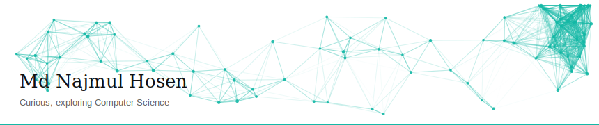
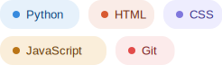

<!--
  ╔══════════════════════════════════════════╗
  ║   Md Najmul Hosen — GitHub Profile       ║
  ╚══════════════════════════════════════════╝
-->

  

 

## About me

Driven by curiosity and a commitment to excellence, I want to build software that transforms ideas into practical solutions. My interests span artificial intelligence, software engineering, and technology-driven innovation — with a long-term goal of contributing to impactful advancements in computing.

 

## Exploring &amp; enjoying

 
 

## Contact

 

  

